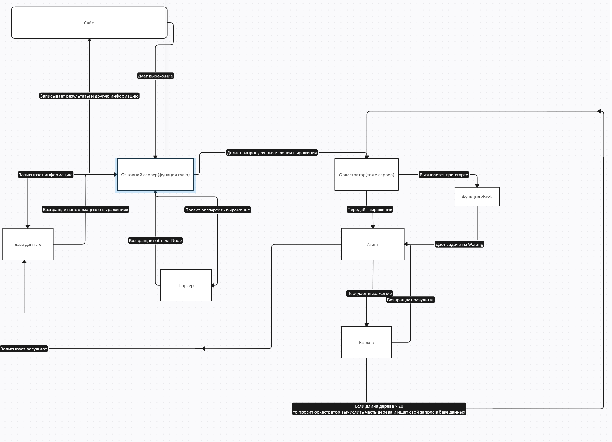

# disCom (от distributive computer)
### А по совместительству и финальная задача
### Мой тг: @Jotyff, просьба писать, если проект не запускается или что-то непонятно, а можно и просто так

Схема моего проекта:

##### Мой проект состоит из следующих компонентов:

1. main.go - основной файл, в котором запускается сервер и другие компоненты
2. orchestrator.go - оркестратор
3. agent.go - агент
4. worker.go - воркер
5. env.go - файл для установки/загрузки переменных среды
6. expression.go - файл в котором содержится класс expression 
7. logger.go - логгер
8. database.go - для работы с базой данных 
9. parser.go - парсер

Подробнее в папке docs

Перед запуском установите все зависимости: `go mod tidy`
##### Как запустить: `go run cmd/main.go`
[Здесь](http://localhost:8080)

##### Как оно работает, опишу весь процесс:
1. С сайта получается выражение, оно записывается в базу данных
2. Выражение отправляется в парсер
3. Если выражение валидно, делается запрос на оркестратор
4. Там делается запрос к агенту и, если все воркеры заняты, то выражение добавлятся в список Waiting
5. Если есть один свободный воркер, выражение поступает на обработку
6. Там выражение вычисляется и если длина дерева > 20, то воркер делает запрос к оркестратору и воркер "ищет" отправленное выражение в базе данных
7. Вычисленное выражение записывается в базу данных

### Важно: выходить из приложения нужно с помощью кнопки "выход", тогда сохранятся те выражения, что не были вычислены
### Программа умеет вычислять плюс, минус, деление и умножение 
Особенности:
Можно изменять количество воркеров в .env
